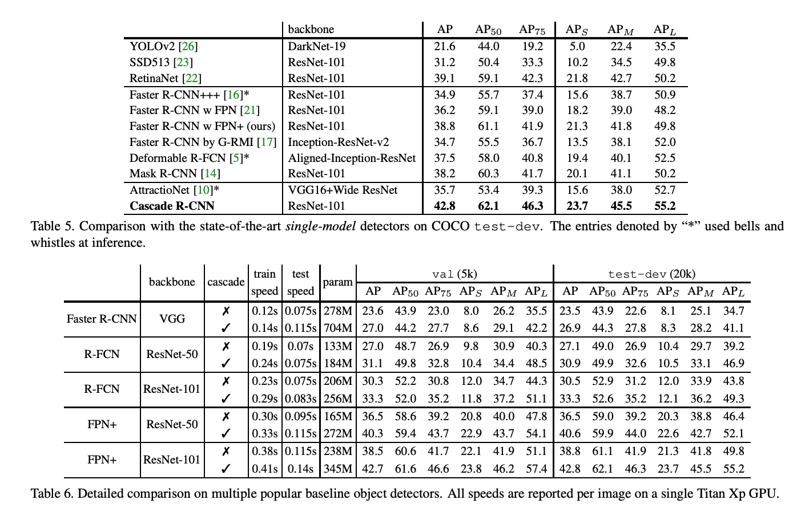

# [Cascade R-CNN: Delving into High Quality Object Detection](https://arxiv.org/abs/1712.00726)

([pdf](https://arxiv.org/pdf/1712.00726.pdf))
- December 2017
- SotA COCO object detection (for 'single-model' detectors - perhaps beaten by ensemble detector?)
- Sequence of detectors trained for different IoU
- Cut down on close false positives
- High IoU detection requires proposal input at both training and inference time to be high IoU. 
    - But RPN generates many low-IoU proposals. 
    - Use a pipeline of detectors to increase the the quality of the proposals being passed to the later stages. Then the final stages are capable of outputting high-IoU boxes predictions.  

### Key Quotes
- "In this work, we define the quality of an hypothesis as its IoU with the ground truth, and the quality of the detector as the IoU threshold `u` used to train it"

- "The basic idea is that a single detector can only be optimal for a single quality level."

- "As shown in the left of Figure 4, the distribution of the initial hypotheses, e.g. RPN proposals, is heavily tilted towards low quality"

- "To produce a high quality detector, it does not suffice to simply increase `u` during training. In fact, [...] this can degrade detection performance. The problem is that the distribution of hypotheses out of a proposal detector is usually heavily imbalanced towards low quality. In general, forcing larger IoU thresholds leads to an exponentially smaller numbers of positive training samples. This is particularly problematic for neural networks, which are known to be very example intensive, and makes the “high `u`” training strategy quite prone to overfitting"

- "A naive solution is to develop an ensemble of classifiers, [...] optimized with a loss that targets various quality levels [`L_total=sum_over_U(L_single_iou)`] where U is a set of IoU thresholds. [...] This solution fails to address the problem that the different losses operate on different numbers of positives. [... As shown in Figure 4,] the set of positive samples decreases quickly with `u`. This is particularly problematic because the high quality classifiers are prone to overfitting. In addition, those high quality classifiers are required to process proposals of overwhelming low quality at inference, for which they are not optimized. Due to all this, the ensemble of fails to achieve higher accuracy at most quality levels, and the architecture has very little gain over that of [Faster R-CNN]."

- "Fig 5a shows the AP curves of three individually trained detectors of increasing IoU, {0.5, 0.6, 0.7}. The detector of `u` = 0.5 outperforms the detector of u = 0.6 at low IoU [thresholds], but underperforms it at higher [thresholds]. However, the detector of `u` = 0.7 underperforms the other two. To understand why this happens, we changed the quality of the proposals at inference.  Figure 5 (b) shows the results obtained when ground truth bounding boxes were added to the set of proposals. While all detectors improve, the detector of `u` = 0.7 has the largest gains, achieving the best performance at almost all IoU [thresholds]. These results suggest two conclusions. First, `u` = 0.5 is not a good choice for precise detection, simply more robust to low quality proposals. Second, highly precise detection requires hypotheses that match the detector quality."

- "Testing all Cascade R-CNN detectors at all cascade stages produced similar observations. Figure 6 shows that each detector was improved when used more precise hypotheses, while higher quality detector had larger gain"

- "In addition, the jointly trained detectors of Figure 6 outperformed the individually trained detectors of Figure 5 (a), even when the same proposals were used. This indicates that the detectors are better trained within the Cascade R-CNN framework."

- "**IoU Thresholds**: A preliminary Cascade R-CNN was trained using the same IoU threshold `u` = 0.5 for all heads. In this case, the stages differ only in the hypotheses they receive [although each stage shifts the IoU distribution fed to the next stage as seen in Figure 4]. [...]. The first row of Table 3 shows that the cascade improves on the baseline detector. [...] The second row shows that, by increasing the stage threshold u, the detector can be made more selective against close false positives and specialized for more precise hypotheses, leading to additional gains."

