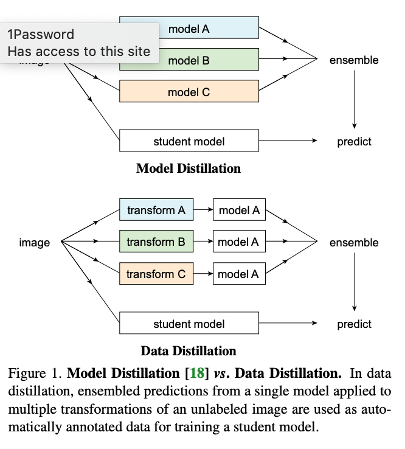
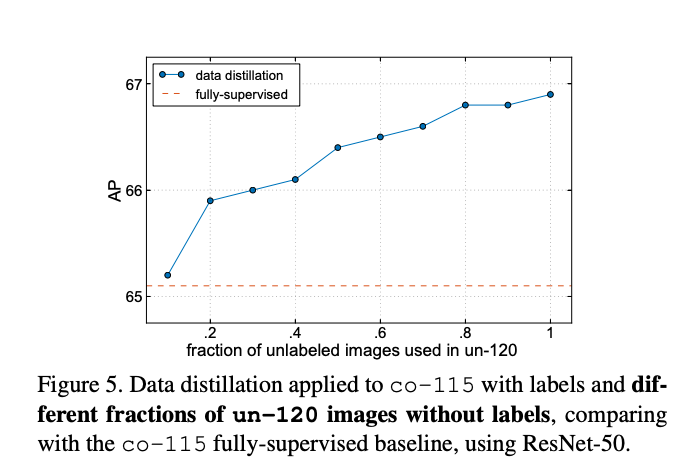

# [Data Distillation: Towards Omni-Supervised Learning](https://research.fb.com/publications/data-distillation-towards-omni-supervised-learning/). 

([pdf](https://research.fb.com/wp-content/uploads/2018/06/Data-Distillation-Towards-Omni-Supervised-Learning.pdf?))

- FAIR 
- CVPR 2018
- 'Omni-supervised learning', where both label and unlabeled data are used to take advantage of the internet-scale quantities of unlabeled data.
- Train a model (the 'teacher') on labeled data and then use that model to label large quantities of data. Use all the data to train a 'student' model. This increases accuracy.
- Try to ensure that the labels being applied to the unlabeled data are as accurate as possible by ensembling predictions on transformed images
- While some techniques were used to adjust to the fact that the labels are imperfect (e.g. set a score threshold that a prediction much exceed for it to be used as a label for training the student), this seems to have minimal importance.
- It was better to train the student model from scratch rather than fine-tune the teacher model.

### Key Quotes

- "[Data distillation] can become realistic largely thanks to the rapid improvement of fully-supervised models in the past few years. In particular, we are now equipped with accurate models that may make fewer errors than correct predictions. This allows us to trust their predictions on unseen data and reduces the requirement for developing data cleaning heuristics"

- "Most research on semi-supervised learning has simulated labeled/unlabeled data by splitting a fully annotated dataset and is therefore likely to be upper-bounded by fully supervised learning with all annotations. On the contrary, omni-supervised learning is lower-bounded by the accuracy of training on all annotated data"

- "We train a Mask R-CNN model using data distillation applied on the original labeled COCO set and another large unlabeled set [...]. Using the distilled annotations on the unlabeled set, [...] we show an up to 2 points AP improvement over the strong Mask R-CNN baseline."

- "Data distillation involves four steps: 
    - (1) training a model on manually labeled data (just as in normal supervised learning)
    - (2) applying the trained model to multiple transformations of unlabeled data
    - (3) converting the predictions on the unlabeled data into labels by ensembling the multiple predictions
    - (4) retraining the model on the union of the manually labeled data and automatically labeled data."

- "Training a model on its own predictions often provides no meaningful information. We address this problem by ensembling the results of a single model run on different transformations (e.g., flipping and scaling) of an unlabeled image. Such transformations [...] improve single-model accuracy [...], indicating that they can provide nontrivial knowledge that is not captured by a single prediction."

- "In comparison with [18], which distills knowledge from the predictions of multiple models, we distill the knowledge of a single model run on multiple transformed copies of unlabeled data"

-  "Generating "hard" labels [as opposed to soft labels which are probabilities] typically requires a small amount of task-specific logic that addresses the structure of the problem (e.g., merging multiple sets of boxes by non-maximum suppression)" 

- "We note that while this procedure requires running inference multiple times, it is actually efficient because it is generally substantially less expensive than training multiple models from scratch, as is required by model distillation"

- "[When training the student model], we ensure that each training minibatch contains a mixture of manually labeled data and automatically labeled data. This ensures that every minibatch has a certain percentage of ground-truth labels, which results in better gradient estimates"

- "This paper opts for geometric transformations for multi-transform inference, though other transformations such as color jittering are possible. The only requirement is that it must be possible to ensemble the resulting predictions"

- "We expect the predicted boxes and keypoints to be reliable enough for generating good training labels. Nevertheless, the predictions will contain false positives that we hope to identify and discard. We use the predicted detection score as a proxy for prediction quality and generate annotations only from the predictions that are above a certain score threshold. In practice, we found that a score threshold works well if it makes “the average number of annotated instances per unlabeled image” roughly equal to “the average number of instances per labeled image”. Although this heuristic assumes that the unlabeled and labeled images follow similar distributions, we found that it is robust and works well even in cases where the assumption does not hold"

- "The student can either be fine-tuned starting from the teacher model or retrained from the initial weights (i.e., those pre-trained on ImageNet). We found that retraining consistently results in better performance, suggesting that the teacher model could have been in a poor local optimum"

### Diagrams
    

---
##### Impact of Unlabeled Data Quantity 

    
 