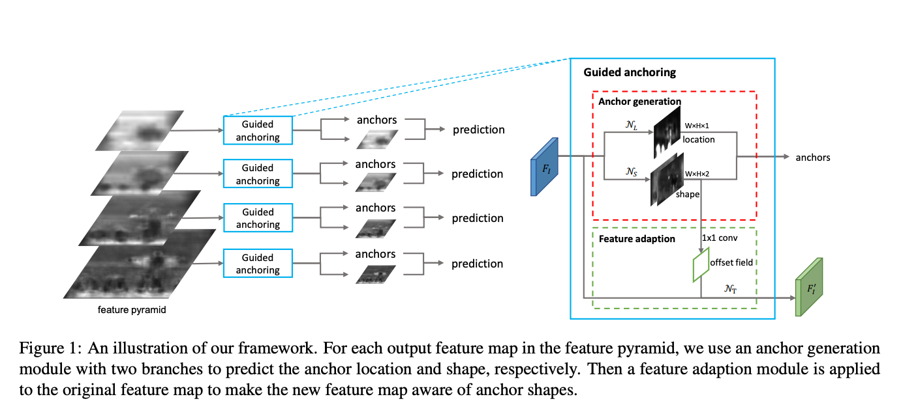
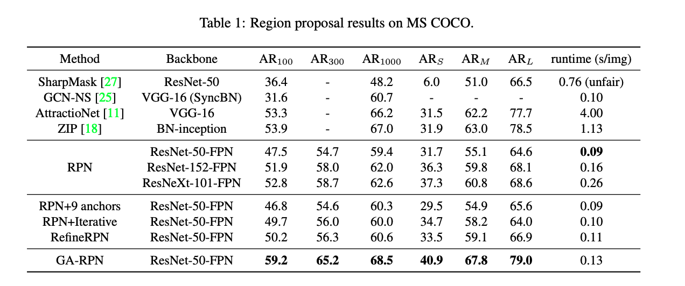
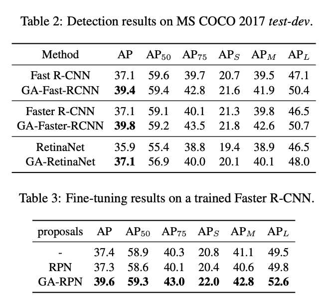
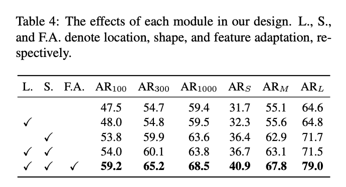

# [Guided Anchoring](https://arxiv.org/abs/1901.03278)

([pdf](https://arxiv.org/pdf/1901.03278.pdf))

- Jan 2019
- SenseTime Joint Lab (The Chinese University of Hong Kong), Amazon Rekognition and Nanyang Technological University
- For RPN based models, learn how to generate anchors instead of using the basic sliding window approach. 
- Improves recall of the RPN
- Has a cost to training time and a cost to RPN inference time, but improves accuracy (across multiple tasks) 
- Use fine-tuning to add GA-RPN to a model training with a classic RPN (3 additional epochs)
- May improve inference time when the model has a heavy head (Mask R-CNN?)
- Anchor generation module predicts where objects will exist and, given the location, what shape the object will be.
- The varying anchor shapes necessitates a feature adaptation module that ensures consistency among features being passed to deeper layers.

### Key Quotes

- "With Guided Anchoring, we achieve 9.1% higher recall on MS COCO with 90% fewer anchors than the RPN baseline"

- "As illustrated in Figure 4, regions like sky and ocean are excluded, while anchors concentrate densely around persons and surfboards.""

- "We also adopt Guided Anchoring in Fast R-CNN, Faster R-CNN and RetinaNet, respectively improving the detection mAP by 2.2%, 2.7% and 1.2%."

- "A fine-tuning schedule using GA-RPN proposals [...] can improve the performance of any [of the] trained models, e.g., it improves a fully converged Faster R-CNN model from 37.4% to 39.6%, in only 3 epochs."

- "A uniform anchoring scheme [...] is not necessarily the optimal way to prepare the anchors. This scheme can lead to two difficulties: 
    - (1) A neat set of anchors of fixed aspect ratios has to be predefined for different problems. A wrong design may hamper the speed and accuracy of the detector. 
    - (2) To maintain a sufficiently high recall for proposals, a large number of anchors are needed, while most of them correspond to false candidates that are irrelevant to the object of interests. Meanwhile, large number of anchors can lead to significant computational cost especially when the pipeline involves a heavy classifier in the proposal stage"

- "By predicting the scales and aspect ratios instead of fixing them based on a predefined list, our scheme handles tall or wide objects more effectively"

- "The location and the shape of an object can be characterized by a 4-tuple in the form of `(x, y, w, h)` [...]. Suppose we draw an object from a given image `I`, then its location and shape can be considered to follow a distribution conditioned on `I`, as follows: `p(x, y, w, h|I) = p(x, y|I)p(w, h|x, y, I)`. This factorization captures two important intuitions: (1) given an image, objects may only exist in certain regions; and (2) the shape, i.e., scale and aspect ratio, of an object closely relates to its location."

- "This [anchor generation module] is a network comprised of two branches for location and shape prediction [...]. On top of [a feature map], the location prediction branch yields a probability map that indicates the possible locations of the objects, while the shape prediction branch predicts location-dependent shapes. [...] Generate a set of anchors by choosing the locations whose predicted probabilities are above a certain threshold and the most probable shape at each of the chosen locations."

- "[On using 1x1 conv layer for probability map branch] While a deeper sub-network can make more accurate predictions [for the probability map], we found empirically that a convolution layer followed by a sigmoid transform strikes a good balance between efficiency and accuracy."

- "As the anchor shapes can vary, the features at different locations should capture the visual content within different ranges. With this taken into consideration, we further introduce a feature adaptation module, which adapts the feature according to the anchor shape."

### Diagrams

---

---

---

guided_anchoring_feature_importance_results
