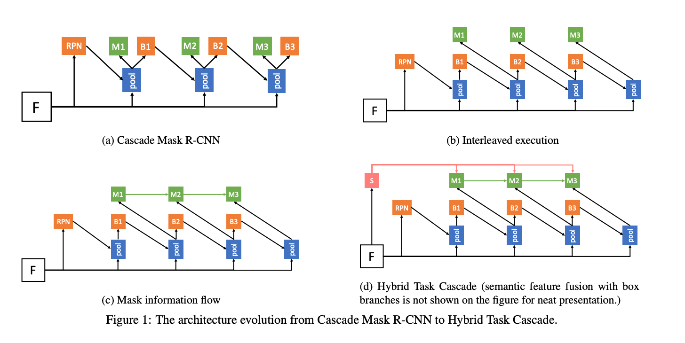
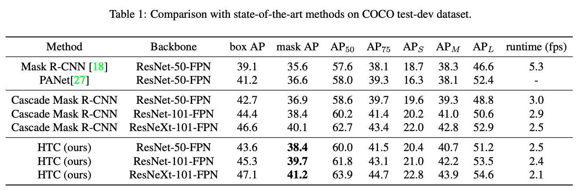

# [[HTC] Hybrid Task Cascade for Instance Segmentation](https://arxiv.org/abs/1901.07518).

([pdf](https://arxiv.org/pdf/1901.07518.pdf)) 

- Jan 2019. 
- SotA COCO Instance Segmentation
- Cascade network for instance segmentation
- Cascade Mask R-CNN is not effective use of cascade  
    - only bounding box information is propagated to the next stage, no mask refinement is done.
    - Mask happens in parallel to bounding box, when bounding box output could help mask make better masks 
- Additional techniques for best known mAP
    - Deformable convolution, SyncBN, Multi-scale training, SENet-154 backbone, Guided Anchoring, Multi-scale testing, Ensemble of {SENet-154, ResNeXt-101 64\*4d, ResNeXt-101 32\*8d, DPN-107, FishNet}

### Key Quotes
- "A direct combination of Cascade R-CNN and Mask R-CNN only brings limited gain in terms of mask AP compared to bbox AP. Specifically, it improves bbox AP by 3.5% but mask AP by 1.2%"

- "Compared to existing frameworks, HTC is distinctive in several aspects: 
    - (1) It interleaves bounding box regression and mask prediction instead of executing them in parallel. 
    - (2) It incorporates a direct path to reinforce the information flow between mask branches by feeding the mask features of the preceding stage to the current one. 
    - (3) It aims to explore more contextual information by adding an additional semantic segmentation branch and fusing it with box and mask branches.
    - Overall, these changes to the framework architecture effectively improve the information flow, not only across stages but also between tasks."

- "From Table 2, we can learn that the interleaved execution slightly improves the mask AP by 0.2%. The mask information flow contributes to a further 0.6% improvement, and semantic segmentation branch leads to a gain of 0.6%."

### Diagrams

--- 

