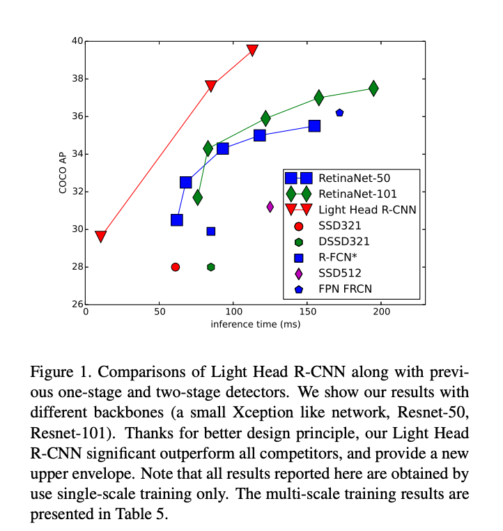
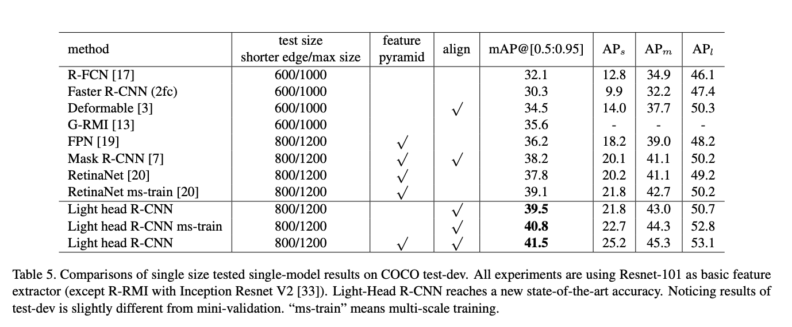
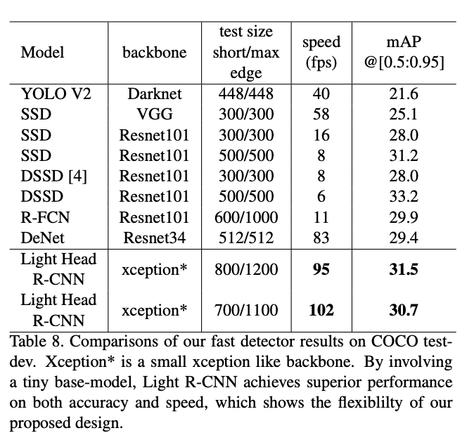
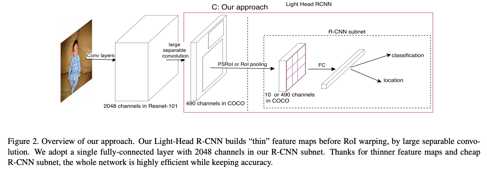
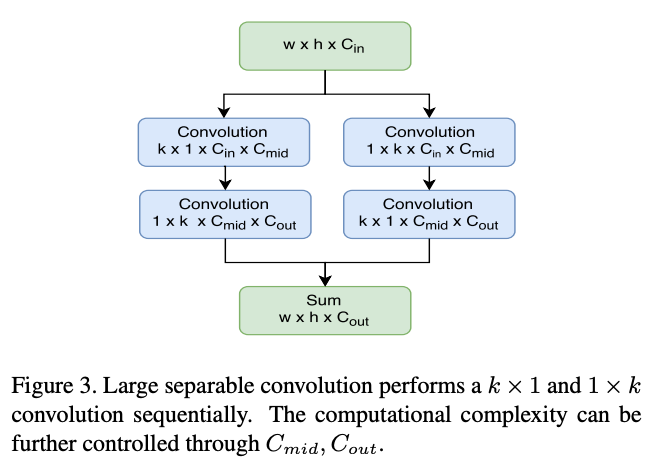

# [Light-Head R-CNN: In Defense of Two-Stage Object Detector](https://arxiv.org/abs/1711.07264).

([pdf](https://arxiv.org/pdf/1711.07264.pdf)) 

- Nov 2017. 
- Megvii. 
- High speed, high accuracy two-stage object detection. Allows tuning between accuracy and speed. 
- The basic idea is to examine the premise that one-stage detectors are faster than two-stage detectors.
- One-stage detectors have been built to optimize for speed, while two-stage detectors have been designed to optimize for accuracy, using a very heavy head to get best possible accuracy.
- Light-head R-CNN introduces a two-stage detector that is optimized for speed, setting a new SotA in terms of speed/accuracy tradeoff (outside of extreme regions), beating RetinaNet by a substantial margin.
- Light-Head R-CNN focuses on techniques for creating cheap, but effective representations of the feature map and RoIs. Insert a layer (large seperable convolution followed by PSRoI pooling) between convolutional feature map and R-CNN subnet that converts heavy conv feature map to a 'thin' feature map without losing critical info.
- Using a basic 1x1 convolution to reduce the number of channels hurts accuracy on small objects while improving on large objects. Large seperable convolution has good accuracy on both large and small objects.
- Light-head R-CNN can be used with computationally heavy backbone to get SotA accuracy or with cheap backbone to get SotA speed/accuracy tradeoff (outside of extreme speed region). 
    - High accuracy used Resnet-101
    - High speed used Xception-like network (see Table 7)
 

### Key Quotes

- "The speed of [two-stage] networks is slow due to the heavy-head design in the architecture. Even if we significantly reduce the base model, the computation cost cannot be largely decreased accordingly"

- "In our design, we make the head of network as light as possible, by using a thin feature map and a cheap R-CNN subnet (pooling and single fully-connected layer)"

- "We apply a large-kernel separable convolution to produce “thin” feature maps with small channel number (α × p × p is used in our experiments and α ≤ 10). This design greatly reduces the computation of [the] RoI-wise subnetwork and makes the detection system memory-friendly. A cheap single fully-connected layer is attached to the pooling layer, which well exploits the feature representation for classification and regression."

- "**R-CNN subnet**. Here we only employ a single fully connected layer with 2048 channels (no dropout) in R-CNN subnet, followed by two sibling fully connected layer to predict RoI classification and regression. Only 4 channels are applied for each bounding box location because we share the regression between different classes. Benefited from the powerful feature maps for RoI warping, a simple LightHead R-CNN can also achieve remarkable results, while keeping the efficiency."

### Results 

--- 

---

### Design Diagrams

