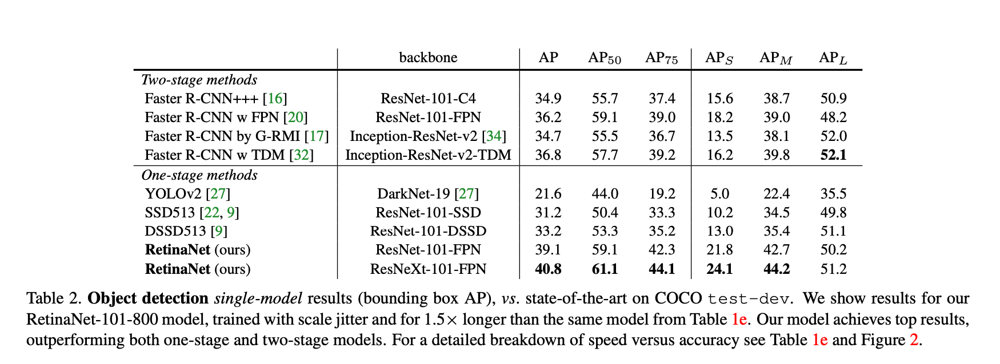
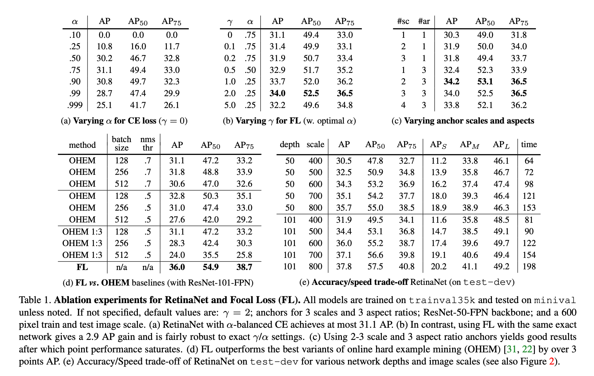

# [[RetinaNet] Focal Loss for Dense Object Detection](https://arxiv.org/abs/1708.02002). 

- FAIR
- Aug 2017
- Highly accurate single-shot detector. Best speed/accuracy tradeoff outside of extreme regions.
- Class imbalance is a major reason single-stage detectors have worse accuracy. Background samples are much more common
- Two-stage detectors have the RPN, as well as sampling heuristics to handle class imbalance.
- Focal Loss is a loss designed to minimize the impact of background samples, by dynamically scaling the loss when it is an easy background sample.
- The exact formulation of the loss is less important than the general concept.
- RetinaNet was built using best practices of the time, but the major accuracy gain was due to focal loss.
- RetinaNet uses an FPN-based feature map backbone. There are two parallel heads - Classification and Box Regression. Each head is an FCN (4 3x3 convs) that is applied to all levels of the FPN backbone. 
- The two heads differ from RPN in that they do not share features and have more conv layers.

### Key Quotes

- "The Focal Loss is designed to address the one-stage object detection scenario in which there is an extreme imbalance between foreground and background classes during training (e.g., 1:1000)"

- "The loss function is a dynamically scaled cross entropy loss, where the scaling factor decays to zero as confidence in the correct class increases"

- "Two-stage detectors [...] address class imbalance through two mechanisms: (1) a two-stage cascade and (2) biased minibatch sampling. The first cascade stage is an object proposal mechanism that reduces the nearly infinite set of possible object locations down to one or two thousand. Importantly, the selected proposals are not random, but are likely to correspond to true object locations, which removes the vast majority of easy negatives."

- "We emphasize that when training RetinaNet, the focal loss is applied to all ∼100k anchors in each sampled image. This stands in contrast to common practice of using heuristic sampling (RPN) or hard example mining (OHEM, SSD) to select a small set of anchors (e.g., 256) for each minibatch."

### Result Tables

##### State of the Art Results

---

##### Ablation and Speed/Accuracy Tradeoff Results

