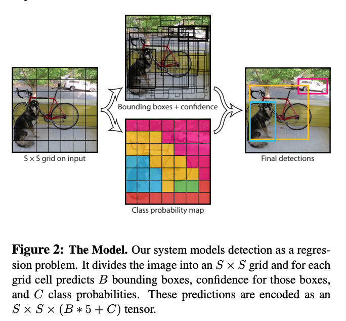

# [[YOLO] You Only Look Once: Unified, Real-Time Object Detection](https://arxiv.org/abs/1506.02640)

([pdf](https://arxiv.org/abs/1506.02640))

- June 2015
- UWashington, Allen Institute for AI, FAIR

- Extremely fast object detection framework
- Lower accuracy is the tradeoff for speed - localization is often off.
- Resizes the input image to a fixed size, divides input image into grid and for each cell in the grid predict boxes and classes. 
    - Each cell creates `B` bounding boxes, and `B` confidence scores that there is an object in the bounding box.
    - Each cell also creates a single set of conditional probabilities (probability that the object is a member of the class given there is an object)
    - This set of conditional probabilities applies to all `B` bounding boxes
- `B` is set at design time, not dynamic
- The models is 24 convolutional layers followed by two fully connected layers.
- The output is a `S × S × (B * 5 + C)` tensor where `S x S` is the size of the grid, `B` is the number of bounding boxes per cell, `5` represents the coordinates of the box + the objectness confidence and `C` is the number of classes.

### Key Quotes

- "We reframe object detection as a single regression problem, straight from image pixels to bounding box coordinates and class probabilities."

- "We can process streaming video in real-time with less than 25 milliseconds of latency"

- "YOLO reasons globally about the image when making predictions. Unlike sliding window and region proposal-based techniques, YOLO sees the entire image during training and test time so it implicitly encodes contextual information about classes as well as their appearance"

- "YOLO still lags behind state-of-the-art detection systems in accuracy. While it can quickly identify objects in images it struggles to precisely localize some objects, especially small ones"

- "At test time we multiply the conditional class probabilities and the individual box confidence predictions, which gives us class-specific confidence scores for each box. These scores encode both the probability of that class appearing in the box and how well the predicted box fits the object"

- "YOLO predicts multiple bounding boxes per grid cell. At training time we only want one bounding box predictor to be responsible for each object. We assign one predictor to be “responsible” for predicting an object based on which prediction has the highest current IOU with the ground truth. This leads to specialization between the bounding box predictors. Each predictor gets better at predicting certain sizes, aspect ratios, or classes of object, improving overall recall"

### Images and Diagrams

